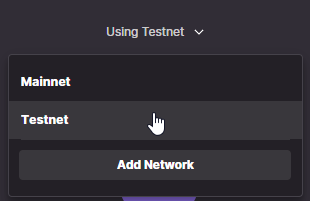
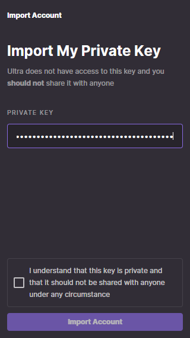
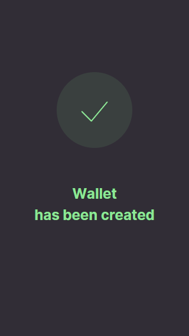

# How to read the Block Explorer

A block explorer is a web tool that allows users to view information about cryptocurrency transactions and blockchain data. It provides details such as transaction history, wallet balances, and block information, enhancing transparency and accountability.
## Setup

1. Download Chrome, Brave, or Chromium Equivalent
2. Install the [Ultra Wallet Chrome Extension](https://chromewebstore.google.com/detail/ultra-wallet/kjjebdkfeagdoogagbhepmbimaphnfln)

## Open Ultra Wallet

Open your `Ultra Wallet` by clicking it inside of the extensions panel.

## Set the Network

Set your network to `Testnet` if you are developing applications. This may need to be done for other applications.

## Import Private Key

::: info

This tutorial is meant for developers, if you are using a non-development account login normally.

:::

Click on `Use Private Key & Password` to import your private key from the [How to Generate a Keypair Tutorial](./how-to-generate-a-keypair.md)

Set a password.

Paste your private key.

## Success!

You have successfully imported your private key into your wallet!